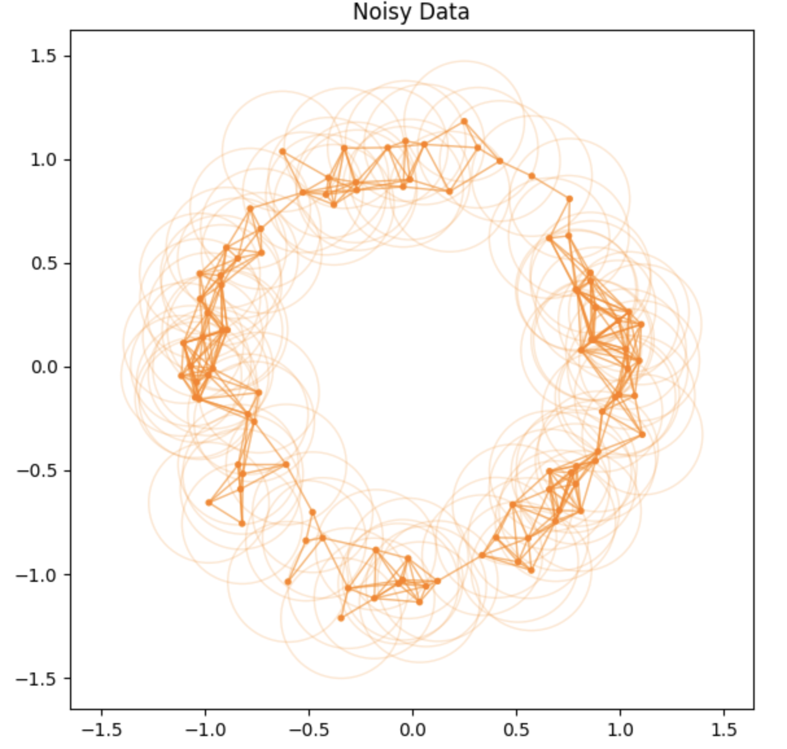
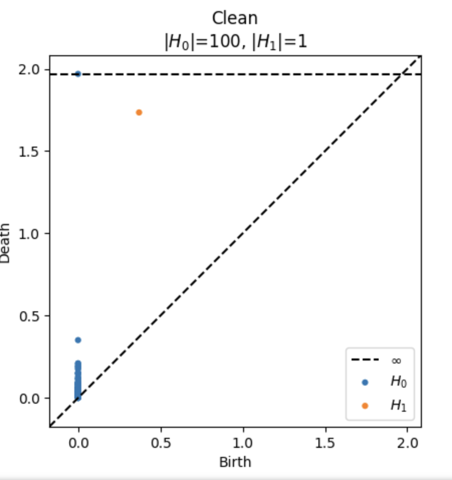
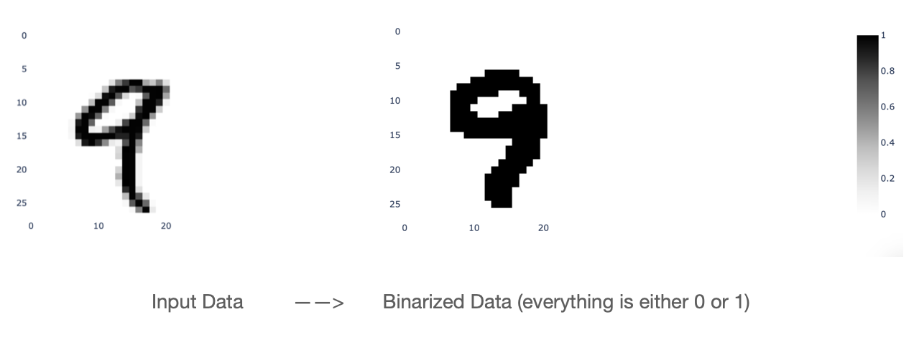
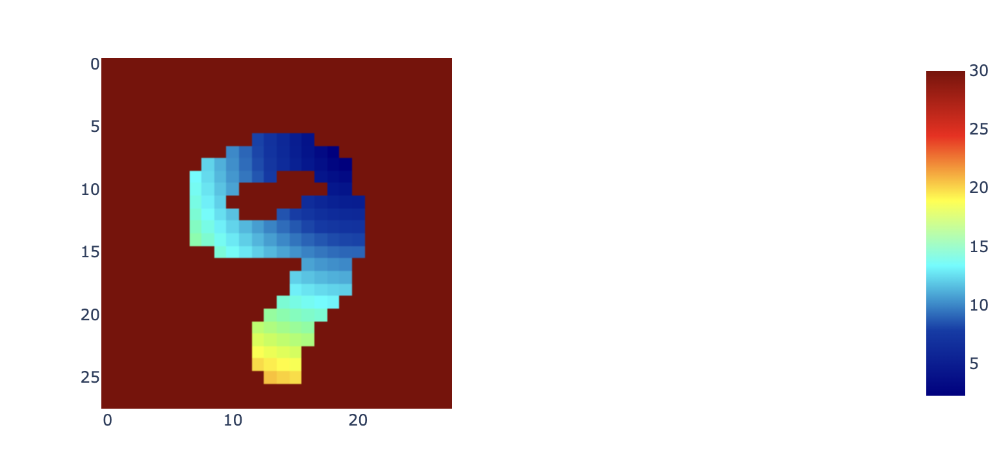
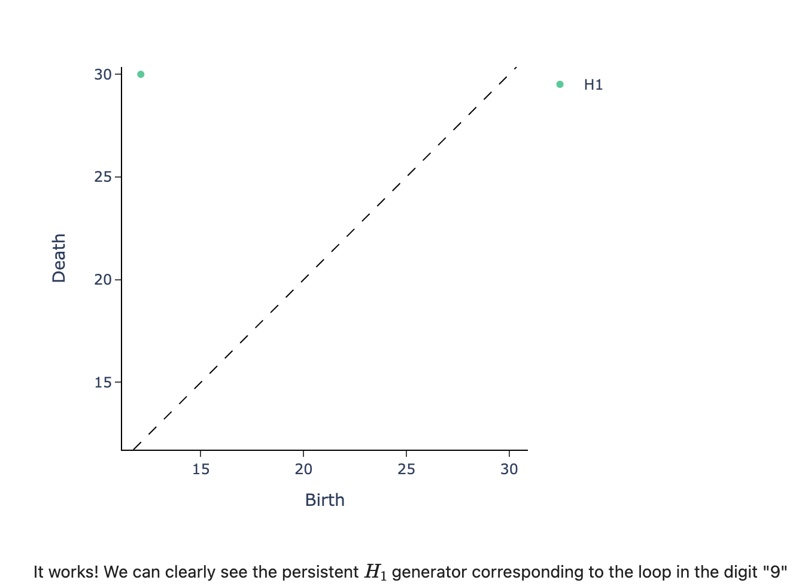
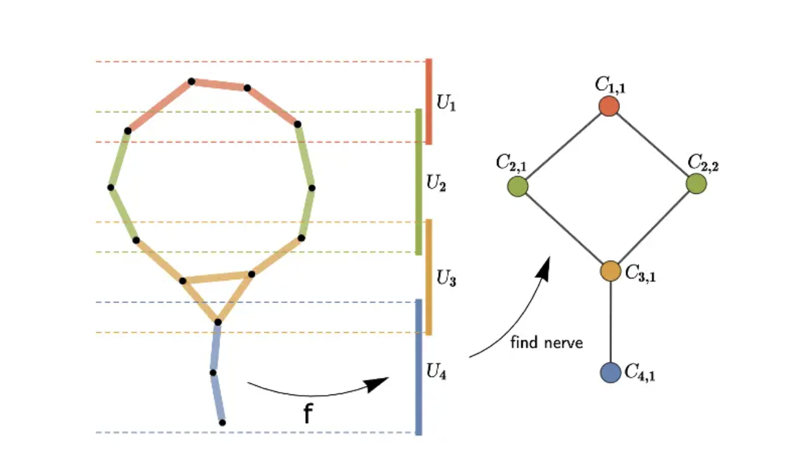
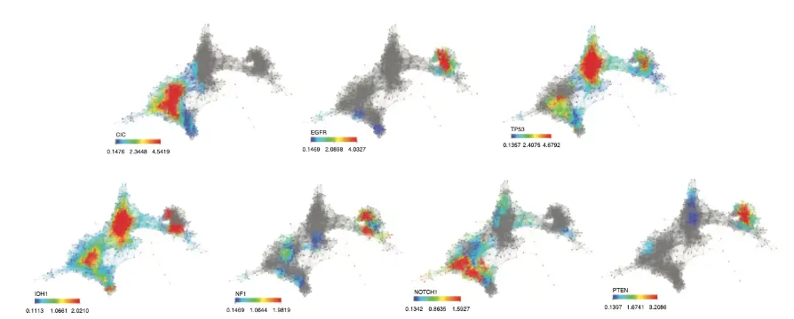

# TDA Applications

 

## Background

Topological Data Analysis (TDA) is a recent field that emerged from various works in applied algebraic topology, a branch of mathematics. Algebraic topology focuses on studying properties of shapes/geometric objects that are preserved under deformations. One classic example is the coffee cup donut equivalence when we think of how one can be continuously stretched/squished into the other.

Today, data is often characterized by having some intrinsic geometric shape.  For example, especially in computer vision, we can think of images as being embedded in Euclidean space, with a number associated to each pixel representing the color intensity at that pixel.  We can further represent data in terms of point clouds, where we might want to embed our data in other spaces.  TDA aims to provide both qualitative and quantitative information about the complex geometric structures underlying this data. It can be highly effective when used in combination with or complementarily to other data science tools.

## Persistent Homology

One useful technique in TDA persistent homology, which can be viewed as examining holes in a shape across different dimensions. In 0D, this would mean the number of connected components, in 1D we would study loops, in 2D we would count voids. In the coffee cup-donut example, both have 1 hole (H2 = $\mathbb{Z}$). In our MNIST example further below, the number '9' when written has a loop so it has an H1 = 1, whereas '8' would have H1 = 2.

In order to use persistent homology there are a few steps:

1. Create simplicial complexes
   - represent data in a [triangulated way](https://mathworld.wolfram.com/SimplicialComplex.html)
2. Apply filtrations
   - around each simplicial complex we can expand a disk and increase the radii of these disks
   
3. Generate persistence diagrams
   - these mark the "birth" and "death" radii of the different holes (H0, H1, H2, ...)
   
4. Extract important topological features
   - i.e. ones with a larger difference between their birth and death, so they "exist longer" and are more important to the data
   
All of these steps are outlined in more detail in or [TDA Sample notebook](https://github.com/jnancy/tda-applications/blob/master/notebooks/TDA%20sample.ipynb).

## TDA (Persistent Homology) Pipeline Example 

In our [MNIST notebook](https://github.com/jnancy/tda-applications/blob/master/notebooks/MNIST_classification.ipynb), we provide a complete albeit very minimal and barebones example of the TDA feature extract pipeline:

1. Preprocess data (e.g. binarization of image, rotations)
   

We skipped the simplicial complex step, since the data is already very nice geometrically.

2. Construct filtrations (the growing circles around a point, we could also use a different shape)
   

3. Generate persistence diagrams to determine important features
   
   
4. Use features as input to classifier of choice (e.g. random forest)

  
We see a noticeable reduction of features needed for model training from the standard 28 x 28 pixel image (28x28=**784 features**) to just **476 topological features**.

This is just a small proof of concept. We can spend more time and effort choosing the embedding of the data (the space can be non Euclidean) as well as how we measure distances between points for more complex datasets. For large ML models, selecting the right features is essential and can lead to exponential time and money savings, in addition to improved accuracy.

## Mapper

Another application of topology, separate from persistence homology is the Mapper algorithm. 

Given a dataset of points, the basic steps behind Mapper are as follows:

1. Map to a lower-dimensional space using a filter function f, or lens. Common choices for the filter function include projection onto one or more axes via PCA or density-based methods. 

2. Construct a cover $(U_i)_{i\in I}$ of the projected space typically in the form of a set of overlapping intervals which have constant length.

3. For each interval $U_i$, cluster the points in the preimage $f^{-1}(U_i)$ into sets $C_{i,1}, ..., C_{i,k_i}$.

4. Construct the graph whose vertices are the cluster sets, and an edge exists between two vertices if two clusters share some points in common.

**Illustration of Mapper Algorithm** ([source](https://arxiv.org/pdf/1904.11044.pdf))

This algorithm is pretty cool since it reduces the dimensional complexity of the original data space substantially into a simpler connected graph, upon which further data analysis/techniques can be used. 

The edges of this graph also represent important relations between data and clusters and topological substructures like loops can be explored further. This is a great tool for dimension reduction since substructures of the original space are found and highlighted and typicall represent the more importent clusters.

**Sample Use Case** ([source](https://www.cambridge.org/core/books/topological-data-analysis-for-genomics-and-evolution/FCC8429FAD2B5D1525AEA47A8366D6EB))

Feature selection with Mapper for identifying driver genes in cancer. Mapper is used to see if patients with a particular alteration present a similar expression profile. Mapper finds three distinct groups with mutated genes. A group enriched in CIC, NOTCH1 and IDH1, another enriched in IDH1 and, TP53 mutations and a last one in EGFR and PTEN mutations.

## Jupyter Notebooks

- [TDA Sample](https://github.com/jnancy/tda-applications/blob/master/notebooks/TDA%20sample.ipynb)
  - outlines commonly used methods for TDA with visualizations
- [MNIST Classification](https://github.com/jnancy/tda-applications/blob/master/notebooks/MNIST_classification.ipynb)
  - complete TDA pipeline, mainly leverages persistent homology for feature extraction
- [Diabetes](https://github.com/jnancy/tda-applications/blob/master/notebooks/diabetes.ipynb) 
  - WIP, includes summary statistics + initial persistence diagrams 

## Further Reading

- [Persistent Homology Introduction](https://towardsdatascience.com/persistent-homology-with-examples-1974d4b9c3d0)
- [ECG Analysis Using Persistent Homology](https://pubmed.ncbi.nlm.nih.gov/36968492/)
- [TDA with Mapper](https://www.quantmetry.com/blog/topological-data-analysis-with-mapper/?fbclid=IwAR3XlfxmST7f7ZHWxyvyQuMC-U108Tzjfq_ND4vUVtDIq51iGWUxqjU8i2U)
- [TDA for Deep Learning](https://towardsdatascience.com/mixing-topology-and-deep-learning-with-perslay-2e60af69c321)
