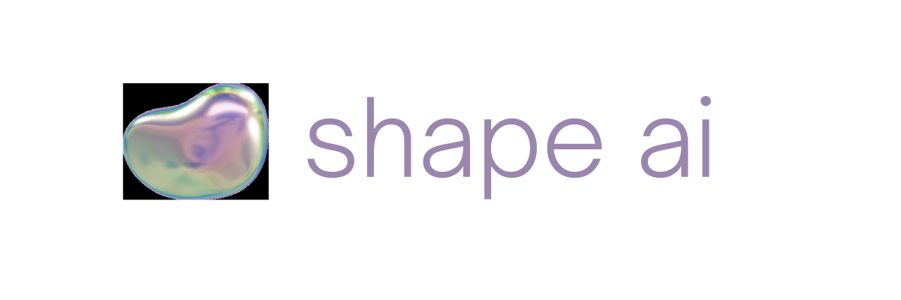

[](https://github.com/facebookresearch/habitat-lab/blob/main/LICENSE)
[](https://www.python.org/downloads/release/python-390/)

# shape.ai

## setup

### docker container

build image

```
docker build -t shape .
```

run container

```
docker run -p 8888:8888 -v "$(pwd)":/app/shape shape
```

## Dataset Results
